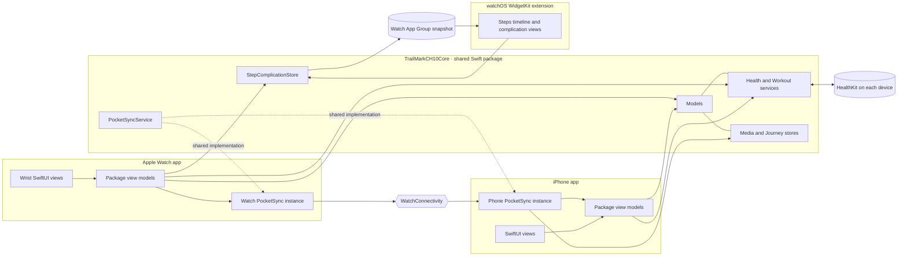

# Program capstone · Trailmark end to end

Trailmark is one iPhone app, one Apple Watch app, one watchOS WidgetKit extension, and one shared Swift package. The iPhone combines Today, Field Journal, Recovery, Workout, and Journeys. The watch offers a focused Home, voice memos, live vitals, motion, and a walking workout. The new **Trailmark Steps** complication reads a watch-local App Group snapshot; it does not need the phone or a HealthKit query from the widget process.

## Whole-system architecture

The diagram's `WC` path is between the two app instances of `PocketSyncService`; it is not direct filesystem sharing between phone and watch. Both app targets import the same package. Models, HealthKit, AVFoundation, Core Motion, Core Location, WatchConnectivity, and persistence logic remain in the package; app views render package view-model state. The extension imports that package's snapshot store but has its own compact WidgetKit presentation.

## Course 3 integration status

| Requirement | Implemented source behavior | Evidence still needed |
| --- | --- | --- |
| Pocket sync (3.1) | `PocketSyncService` activates `WCSession` on both sides. Completed watch workouts queue `WatchActivityRecord`; watch memo `.m4a` files and metadata queue separately. The phone imports activity into Journeys and audio into Field Journal. Durable outbox/inbox state supports retries. | A paired-device recording showing the watch activity in iPhone Journeys and playing the transferred memo in iPhone Journal. |
| Live workout (3.2) | `WorkoutSessionService` runs `HKWorkoutSession` with `HKLiveWorkoutBuilder`, streams heart rate, elapsed time, and energy, and calls `finishWorkout()` on completion. The watch has `workout-processing` background mode. | Physical-watch background demonstration and the matching saved `HKWorkout` in Apple Health. |
| Performance (3.3) | Motion requests 5 Hz instead of 10 Hz, publishes UI state at most once per second instead of twice, and aggregates on its sensor queue instead of scheduling every sample on MainActor. | Before/after Instruments values and screenshots from the same physical-watch protocol. Calculated source rates below are **not** measurements. |
| Complication (3.4) | `TrailmarkStepsWidget` is an embedded watchOS WidgetKit extension with circular watch-face and rectangular watch-face/Smart Stack families. `StepComplicationStore` writes readable steps from watch Home or Vitals to `group.com.example.TrailmarkCH10`; the widget reads that snapshot. | Register the App Group in the developer account/signing profiles, install on a physical watch, add the complication to a face or Smart Stack, and capture the result. |

Apple documents [rectangular accessory widgets](https://developer.apple.com/documentation/widgetkit/widgetfamily/accessoryrectangular) for both watch faces and the Smart Stack, and [App Groups](https://developer.apple.com/documentation/xcode/configuring-app-groups) for sharing data with an extension. The extension and its containing watch app have the same group entitlement; the iPhone app does not need access to this watch-local snapshot.

### WatchConnectivity transfer choices

| Payload | Chosen transfer | Why |
| --- | --- | --- |
| Latest replaceable activity summary | `updateApplicationContext` | The latest state matters; older summaries can be superseded. A live message would require reachability, and queued `userInfo` would retain obsolete snapshots. |
| Completed activity record | `transferUserInfo` | Each finished workout is a distinct small record that must queue and arrive even when the phone is not reachable. Application context could replace one record with another. |
| Voice-memo file plus metadata | `transferFile` | The recording is a binary file that needs queued delivery. A message or user-info dictionary is the wrong transport for its bytes; context would replace earlier memos. |

The phone stages an incoming file before WatchConnectivity removes its temporary URL and removes the staged copy only after the local Journal import succeeds. A transport completion is not presented as proof that the phone persisted the memo.

### Workout and independent watch behavior

Starting a walk is an explicit action. Health authorization occurs when needed, not at watch-app launch. `WKBackgroundModes` includes `workout-processing`, and the workout service remains owned by the watch composition root while the view changes. Finishing the builder produces the Health workout before the session is released; the save receipt helps identify the matching Health entry. The watch still opens Home, Voice Memos, and Motion without a phone connection or Health permission. Pocket Sync holds outgoing records/files until the companion is available. The complication shows an unavailable dash until the watch has a readable step count; it never fabricates a zero or triggers its own Health prompt.

### Performance before/after

The following source settings quantify the **design change**, not an Instruments result:

| Source setting | Before | After | Tradeoff |
| --- | ---: | ---: | --- |
| Requested Core Motion cadence | 10 Hz | 5 Hz | Very brief wrist movement is easier to miss. |
| Maximum Motion UI publication | 2 Hz | 1 Hz | State can appear about a second later. |
| Sensor callbacks that schedule a MainActor task, per nominal 60 seconds | Up to 600 | Up to 60 | Accumulation state is managed on the sensor queue. |

| Physical-watch Instruments metric, same selected region | Before | After | Change | Evidence |
| --- | --- | --- | --- | --- |
| Watch app CPU time or Time Profiler sample %, with unit | **Pending** | **Pending** | **Pending** | Before/after trace screenshots |
| Allocations peak live bytes, with unit | **Pending** | **Pending** | **Pending** | Before/after trace screenshots |
| Watch energy impact, only if supported by the available instrument | **Pending or unavailable** | **Pending or unavailable** | **Pending** | Watch trace if available |

The [Make it last report](MakeItLastAssignment.md) specifies an identical 180-second motion routine and how to capture these values. The capstone performance criterion is **not complete** until real measurements are entered here and the screenshots are attached. No battery or CPU saving is inferred from requested rates alone.

## Live demo and submission plan

1. On the physical watch, show Home and Voice Memos without first connecting Health or the phone. Record and save a memo; begin an outdoor walk, show heart rate/time/energy, lower the wrist or leave the workout screen briefly, then finish and save.
2. In Apple Health, show the matching walking workout. On the paired iPhone, show the imported activity in Journeys and play the transferred memo in Field Journal. Explain the three transfer types above.
3. With both targets signed for the same App Group, enable watch Health and refresh steps, add **Trailmark Steps** to a watch face and/or Smart Stack, and show its current or explicitly unavailable state.
4. Present the architecture diagram and the two real before/after Instruments screenshots/values. Explain the slower reaction and possible missed brief motion as the energy tradeoff.

Capture a short continuous or clearly edited cross-device demo, the architecture diagram, face/Smart Stack image, Health workout image, and Instruments screenshots. Submit this same Xcode project and package plus the actual source link. The source compiles without a physical watch; compilation alone does not satisfy the required live/device and measured-performance evidence.

## Limitations and next steps

The step complication is a cached snapshot, not a continuous sensor display. It updates after readable Home/Vitals data arrives and asks WidgetKit to reload only when the step value changes or an unchanged snapshot ages 15 minutes. The system still controls actual widget refresh timing. It clears yesterday's value at the next timeline refresh and clears the cache when the user chooses **Continue Without Health**. A Health-denied or simulator watch remains usable and displays an unavailable complication. Route recording remains foreground-oriented, and watch-to-phone sync requires a paired companion eventually, though it does not block local watch capture or workout saving. Provisioning the App Group and demonstrating on physical devices remain part of final submission.
